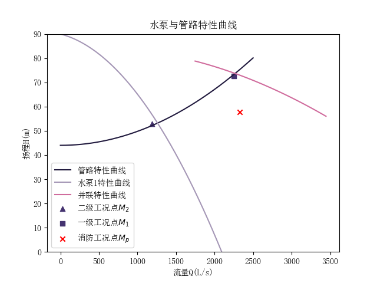

# 泵站设计

## 一、已知资料

- 输水管和给水管网最大供水时总水头损失$\sum h = 27.2 \text{m}$
- 清水池最低水位至设计最不利点地面高差$Z_c = 8.0 \text{m}$
- 消防流量$Q_x = 270 \text{m}^3$时，消防总损失$\sum h_x = 38.1 \text{m}$

## 二、水泵机组的选择

### 1. 泵站设计参数的确定

一级工作时
$$
Q_1 = 16 \times 10^4 (m^3/d) \times 5.06\% = 8096 (m^3/h) = 2248.9 (L/s)
$$

二级工作时
$$
Q_2 = 16 \times 10^4 (m^3/d) \times 2.68\% = 4288 (m^3/h) = 1191.2 (L/s)
$$

一级工作时设计扬程
$$
\begin{align*}
H_1 &= Z_c + H_0 + \sum h + \sum h_{in} \\
    &= 8 + 36(8 levels) + 27.2 + 1.5 \\
    &= 72.7 (m)
\end{align*}
$$

### 2.选择水泵

$$H_{ST} = 8 + 36 = 44(m)$$
$$
\begin{align*}
    S &= \frac{\sum h + \sum h_{in}}{Q^2} \\
    &= \frac{27.2 + 2}{2.2489 ^ 2} \\
    &= 5.78 (s^2 / m^5)
\end{align*}
$$
$$\therefore H = 44 + 5.78 Q^2$$

列举可用水泵集合，编程枚举任两水泵，联立求解单一水泵工况点，并用横加法求解并联工作时工况点，得以下两较优方案

- 方案一
  - 水泵1为KQSN700-N9(规格798)，水泵2为KQSN800-M9(规格1038)
    - 水泵1运行时功率1000kW，工况点$Q = 1253.3 (L/S), \ H = 63.0 (m)$，满足二级需求
    - 两泵并联时功率2400kW，工况点$Q = 2258.5 (L/S), \ H = 73.5 (m)$，满足一级需求
    - 再准备一台与水泵1相同型号水泵备用
- 方案二
  - 水泵1为KQSN700-N9(规格751)，水泵2为KQSN800-M13(规格765)
    - 水泵1运行时功率900kW，工况点$Q = 1203.0 (L/S), \ H = 56.0 (m)$，满足二级需求
    - 两泵并联时功率2500kW，工况点$Q = 2267.0 (L/S), \ H = 73.7 (m)$，满足一级需求
    - 再准备一台与水泵1相同型号水泵备用

由于方案二保证水泵1两种情况下都在高效段，故选用方案二

绘制图像如下

此时两水泵参数如下

- 水泵1
  - $Q \in [601.6, 1203.2] (L/s)$
  - $H \in [56, 79] (m)$
  - $n = 990 (r/min)$
  - $\eta \in [76.5, 78.0] (\%)$
  - $N = 900 (kW)$
  - $\text{NPSH} = 5.4 (m)$
- 水泵2
  - $Q \in [1121.3, 2242.6] (L/s)$
  - $H \in [56, 79] (m)$
  - $n = 990 (r/min)$
  - $\eta \in [79.5, 81.5] (\%)$
  - $N = 1600 (kW)$
  - $\text{NPSH} = 8.1 (m)$

### 3.确定电机

- 电机1：Y900-6/1180
  - 额定功率900kW
  - 额定转速991r/min
  - 额定电压10kW
- 电机2：Y1600-6/1430
  - 额定功率1600kW
  - 额定转速991r/min
  - 额定电压10kW

